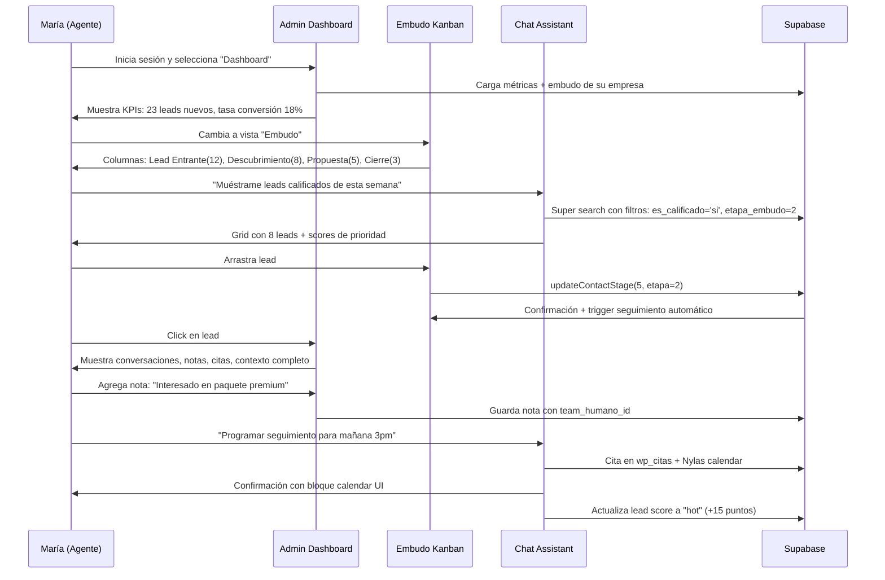
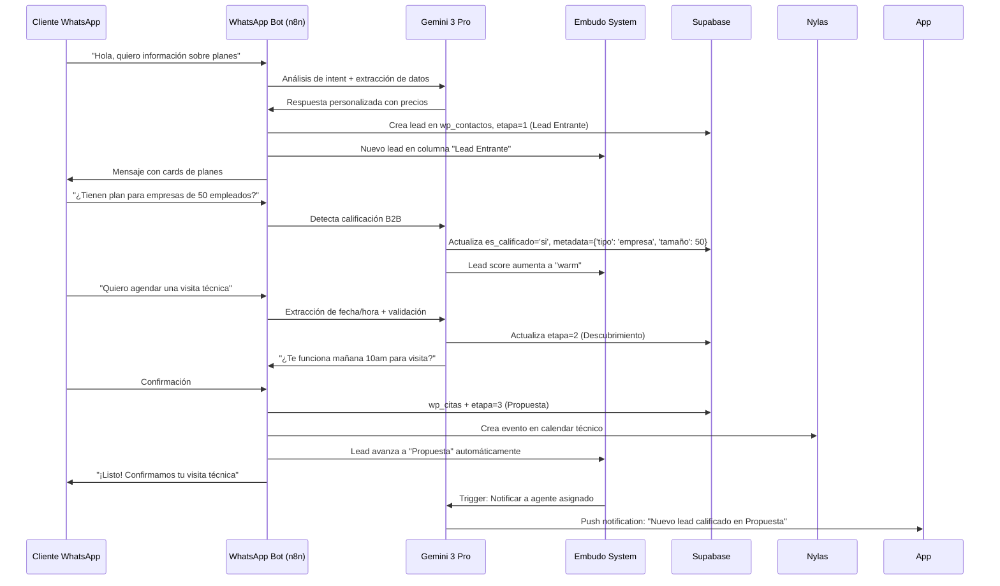

## 🎯 Identidad del Proyecto
**Chat Urpe AI LAB** es un dashboard de inteligencia de negocios conversacional de alto rendimiento con modo oscuro y enfoque en UI dinámica. Versión 4.0.0 construido con Next.js 14, Supabase y tailwindCSS.

---

## 🏗️ Arquitectura Principal

### Stack Tecnológico
- **Frontend**: Next.js 14.2 (App Router), React 18.2, TypeScript 5.2
- **Estilos**: Tailwind CSS 3.4 (Dark Mode nativo, alto contraste)
- **Estado**: Zustand 4.5 (Persistencia local + IndexedDB)
- **Backend**: Supabase (PostgreSQL, Auth, Realtime, Edge Functions)
- **IA**: Vercel AI SDK 3.4, integración con Gemini/OpenAI vía n8n
- **Visualización**: Recharts, Lucide React, Markdown

### Estructura de Directorios Clave
- **/app**: Rutas Next.js (API routes, auth, layouts)
- **/components**: Bloques UI reutilizables (KPIs, gráficos, admin)
- **/hooks**: Lógica de negocio (`useChatReliable`, `useAdminMetrics`)
- **/lib**: Utilitarios y clientes (Supabase, UI Registry)
- **/store**: Gestores estado global (Auth, Chat, Admin, Contact)
- **/types**: Definiciones TypeScript (Protocolo UI, entidades BD)

---

## 💾 Modelo de Datos (Supabase)

### Chat y Mensajería
- `chat_sessions`: Sesiones conversación (`user_id`, `title`)
- `chat_messages`: Historial mensajes (`session_id`, `role`, `content`, `metadata`)
- `message_requests`: Cola procesamiento para garantías entrega

### Negocio y CRM
- `wp_team_humano`: Perfiles usuarios/agentes (`auth_uid`, `empresa_id`, `rol`)
- `wp_empresa_perfil`: Datos empresas/clientes
- `wp_proyectos`: Contenedores de tareas y configuración de vistas
- `wp_tareas`: Unidad de trabajo con soporte de checklist y contexto
- `wp_conversaciones`: Registro conversaciones WhatsApp/CRM
- `wp_citas`: Gestión citas y calendario
- `wp_contactos`: Base datos leads y clientes

### Finanzas y Archivos
- `wp_crm_servicios`: Registro de servicios vendidos y valores totales
- `wp_crm_pagos`: Historial de abonos con link a comprobante (`comprobante_url`)
- **Storage Buckets**:
  - `comprobantes`: Recibos de pago (Imágenes/PDF)
  - `contratos`: Documentos legales
  - `avatars`: Imágenes de perfil

---

## 🎨 Protocolo UI Dinámica v5

### Bloques Soportados
- `kpi_card`: Métricas con temas visuales
- `chart`: Gráficos temáticos (bar, line, pie)
- `table`: Tablas con estados
- `form`: Formularios contextuales
- `actions`: Botones con estados
- `calendar`: Calendarios temáticos
- `grid`: Cuadrícula de tarjetas
- `card`, `cards`: Tarjetas detalladas
- `image`: Imágenes con temas
- `error/warning/info`: Notificaciones contextuales

### Paleta de Colores Integrada
Sistema semántico con temas: `success`, `warning`, `error`, `info`, `primary`, `secondary`, `special`, `neutral`, `default`

---

## 🔄 Estrategia de Sincronización

### Híbrido Resiliente
- **Estado Local**: Zustand + IndexedDB (offline-first)
- **Sincronización**: Supabase Realtime + polling fallback
- **Entrega Garantizada**: Fire-and-forget + tracking requests
- **Autenticación**: Flujo PKCE con Supabase Auth

---

## 📊 Módulos Principales

### 1. Chat App (Frontend IA)
- Interfaz para interactuar con modelos IA
- Generación de contenido y análisis de datos
- Configuración de agentes

### 2. Admin Dashboard (Backend Negocio)
- **Dashboard**: Métricas en tiempo real (clientes, mensajes, citas)
- **Scheduling**: Vista calendario para agentes
- **Contacts**: Gestión CRM, leads, auto-response
- **Funnel**: Kanban pipeline (Contact → Register → Filter → Schedule)
- **Messages**: Historial WhatsApp y monitoreo

### 3. Gestión Financiera
- **Servicios**: Seguimiento de servicios contratados y valores
- **Pagos**: Control de abonos, saldos y estados de pago
- **Comprobantes**: Gestión de archivos (recibos/contratos) en Storage
- **Validación**: Control de tipos de archivo y tamaños

---

## 🛠️ Componentes Técnicos Clave

### Hooks de Chat
- `useChatReliable`: Entrega garantizada con polling
- `useChatSync`: Sincronización Realtime con deduplicación
- `useAdminMetrics`: Métricas deterministas desde Supabase

### Stores Zustand
- `authStore`: Gestión autenticación Supabase
- `chatStore`: Estado centralizado chat y UI
- `contactStore`: Gestión contactos y CRM
- `adminStore`: Métricas y panel administrativo
- `financeStore`: Gestión de servicios, pagos y reportes financieros

---

## 🔧 Variables de Entorno
```bash
# Supabase (público)
NEXT_PUBLIC_SUPABASE_URL=https://vecspltvmyopwbjzerow.supabase.co
NEXT_PUBLIC_SUPABASE_ANON_KEY=[CLAVE_PÚBLICA]

# IA (privado)
GEMINI_API_KEY=[CLAVE_PRIVADA]
```

---

## 🚀 Características Destacadas

- **Dashboard Dinámico**: Visualización KPIs y gráficos en tiempo real
- **Chat Resiliente**: Garantía entrega, soporte offline, sincronización vivo
- **UI Generativa**: Renderizado interfaces complejas desde JSON
- **Gestión CRM**: Administración contactos, citas, embudos venta
- **Multi-Empresa**: Soporte múltiples entornos empresariales
- **Tema Oscuro**: Estética minimalista alto contraste

---

## 🏗️ Sistema de Embudo de Ventas (Sales Funnel)

### Arquitectura del Embudo
- **`wp_empresa_embudo`**: Definición de etapas personalizadas por empresa
  - `nombre_etapa`: Nombre descriptivo (Ej: "Prospecto", "Calificado", "Cliente")
  - `orden_etapa`: Secuencia lógica del proceso
  - `empresa_id`: Multi-tenancy para diferentes clientes
  - `configuracion_seguimiento`: Reglas automáticas por etapa

- **`wp_contactos`**: Gestión de leads con contexto de embudo
  - `etapa_embudo`: FK a wp_empresa_embudo
  - `es_calificado`: Estado de calificación (si/no/evaluando)
  - `estado`: Ciclo de vida (prospecto/cliente/evaluando)
  - `metadata`: JSON flexible para tags y campos personalizados

### Componentes de UI del Embudo

#### 1. **ContactsFunnelView.tsx** - Vista Híbrida
- **Modo Tabla**: Lista optimizada con sorting avanzado (12 opciones)
- **Modo Kanban**: Drag & drop visual entre etapas
- **Super Search**: Búsqueda multifuente con scoring por relevancia
- **Filtros Contextuales**: Estado, calificación, agente, rango de fechas

#### 2. **FunnelView.tsx** - Especialización Kanban
- Interfaz pura de drag & drop
- Columnas dinámicas según configuración de empresa
- Columna "Sin etapa" para contacts no clasificados
- Actualización en tiempo real de `etapa_embudo`

#### 3. **contactStore.ts** - Gestión de Estado
- **Caché Inteligente**: 5 minutos por módulo (contacts, funnelStages)
- **Preload Paralelo**: Carga optimizada al cambiar empresa
- **Acciones del Embudo**:
  - `fetchFunnelStages()`: Obtiene etapas por empresa
  - `updateContactStage()`: Mueve contacts entre etapas
  - `fetchContacts()`: Super search con scoring

### Flujo de Trabajo del Embudo

#### 1. **Configuración por Empresa**
```typescript
// Ejemplo: Empresa de Servicios Digitales
const etapas = [
  { id: 1, nombre_etapa: "Lead Entrante", orden_etapa: 1 },
  { id: 2, nombre_etapa: "Descubrimiento", orden_etapa: 2 },
  { id: 3, nombre_etapa: "Propuesta", orden_etapa: 3 },
  { id: 4, nombre_etapa: "Negociación", orden_etapa: 4 },
  { id: 5, nombre_etapa: "Cierre", orden_etapa: 5 }
];
```

#### 2. **Proceso de Clasificación**
1. **Captura**: WhatsApp/Formulario → `wp_contactos`
2. **Calificación**: IA analiza conversación → `es_calificado`
3. **Asignación**: Drag & drop o automático → `etapa_embudo`
4. **Seguimiento**: Reglas por etapa → acciones automáticas

#### 3. **Contexto Enriquecido de Contactos**
```typescript
interface ContactContext {
  displayName: string;
  status: { label: string; color: string; priority: 'high' | 'medium' | 'low' };
  leadScore: { value: number; level: 'hot' | 'warm' | 'cold'; factors: string[] };
  funnelStage?: string;  // Etapa actual del embudo
  lastActivity: { date: string; relativeTime: string; type: string };
  quickActions: { canCall: boolean; canEmail: boolean; hasAppointment: boolean };
}
```

### Algoritmos de Inteligencia del Embudo

#### 1. **Super Search con Scoring**
```typescript
// Sistema de puntuación multifuente
const scoringRules = {
  'nombre/apellido': 100,      // +50 si empieza con término
  'email/teléfono': 50,        // Datos de contacto directo
  'metadata JSON': 30,         // Campos personalizados
  'notas': 40,                 // Notas de agentes
  'mensajes': 10,              // Contenido conversacional
  'resumen conversación': 20   // Insights de IA
};
```

#### 2. **Lead Score Dinámico**
```typescript
// Factores de calificación automática
const leadFactors = {
  es_calificado: '+30 puntos',
  estado_cliente: '+25 puntos',
  telefono_email: '+20 puntos',
  actividad_reciente: '+15 puntos',
  multiples_conversaciones: '+10 puntos',
  con_citas_agendadas: '+15 puntos'
};
```

#### 3. **Context Generation Optimizado**
- **Pre-computación**: O(n) para todos los contactos
- **Sorting por relevancia**: O(n log n) con contexto pre-calculado
- **Caché persistente**: IndexedDB + Zustand para offline

### Integraciones del Embudo

#### 1. **Conversaciones WhatsApp**
- `wp_conversaciones` → análisis de sentimiento
- `wp_mensajes` → contexto de interacción
- IA detecta intención y califica automáticamente

#### 2. **Sistema de Citas**
- `wp_citas` → engagement tracking
- Nylas Calendar → sincronización externa
- Automatización de seguimiento por etapa

#### 3. **Notas y Colaboración**
- `wp_contactos_nota` → historial de gestión
- `team_humano_id` → asignación de responsable
- Edición inline con confirmación

### Métricas del Embudo

#### 1. **KPIs de Conversión**
```typescript
interface FunnelMetrics {
  totalContacts: number;
  stageDistribution: Record<string, number>;
  conversionRate: number;  // Contactos → Citas
  avgTimeInStage: Record<string, number>;
  dropoffPoints: string[];
}
```

#### 2. **Dashboard de Embudo**
- **Tasa de Conversión**: Contactos / Citas
- **Tiempo en Etapa**: Promedio por etapa
- **Puntos de Abandono**: Etapas con mayor pérdida
- **Rendimiento por Agente**: Asignación vs conversión

### Casos de Uso del Embudo

#### 1. **Agente Comercial**
- Arrastra "Lead Entrante" → "Descubrimiento"
- Sistema asigna automáticamente si hay alta actividad
- Notificaciones de leads "hot" para priorizar

#### 2. **Supervisor de Operaciones**
- Vista consolidada de todas las etapas
- Identificación de cuellos de botella
- Reasignación masiva entre agentes

#### 3. **Marketing Automation**
- Leads por campaña → etapa específica
- Secuencias de email por etapa
- Scoring basado en comportamiento

---

## 📋 Gestión de Tareas y Proyectos (V2)

### Arquitectura de Tareas
El sistema de tareas ha sido rediseñado para soportar un flujo de trabajo flexible basado en metodologías GTD (Getting Things Done) y Kanban.

- **Modelo de Datos**: `wp_tareas` es la entidad central, enriquecida con `wp_tareas_items` (checklists).
- **Contexto Universal**: Las tareas pueden asociarse a múltiples contextos:
  - **Proyectos**: Agrupación lógica y visual (`proyecto_id`)
  - **Contactos**: Tareas CRM (`contacto_id`)
  - **Citas**: Preparación o seguimiento (`cita_id`)
  - **Conversaciones**: Accionables desde chats (`conversacion_id`)
  - **Inbox**: Tareas sin proyecto asignado (captura rápida)

### Gestión de Proyectos
- **Contenedores Flexibles**: `wp_proyectos` permite agrupar tareas con metadatos visuales (color, icono).
- **Vistas Configurables**: Soporte para vistas de lista y Kanban (configuración JSON).
- **Sincronización de Contadores**: Lógica optimizada en `updateTask` para mantener contadores de tareas pendientes/completadas en tiempo real sin recargas costosas.

### Componentes UI de Tareas
- **`TasksView`**: Vista principal con filtros avanzados y búsqueda local.
- **`ProjectsSidebar`**: Navegación jerárquica con contadores en tiempo real.
- **`TaskCard`**: Tarjeta interactiva con soporte de checklist expandible y estados visuales.
- **`TaskModal`**: Formulario de creación/edición con soporte para generación por IA (Gemini).

### Lógica de Negocio (Stores)
- **`tareasStore`**: CRUD completo con optimistic updates y manejo de relaciones complejas.
  - **Validaciones**: Guardas de seguridad para integridad de datos.
  - **Selectores Memoizados**: `selectTasksByProject`, `selectOverdueTasks` para performance.
- **`proyectosStore`**: Gestión de proyectos y sincronización de contadores (Inbox/Proyectos).

### Integración con IA
- **Generación de Tareas**: Análisis de contexto de contacto/conversación para sugerir tareas automáticamente vía endpoint `/api/monica/task-suggestion`.

### Gamificación
- **Sistema de XP**: Otorgamiento automático de experiencia al completar tareas (`task_completed`) y bonus por puntualidad (`task_completed_on_time`).
- **Micro-logros**: XP adicional por completar items individuales de checklist (`task_item`).

---

## 🎨 Sistema de Diseño y Estilo Visual

### 🌑 Filosofía de Diseño: Minimalismo Oscuro con Alto Contraste

**Chat Urpe AI LAB v4.0** implementa una estética visual moderna basada en:
- **Minimalismo funcional**: Elementos esenciales sin decoración innecesaria
- **Alto contraste**: Máxima legibilidad en fondos oscuros profundos
- **Jerarquía visual clara**: Guía intuitiva del usuario mediante contraste y color
- **Interactividad sutil**: Estados visuales que responden sin distraer

### 🎨 Paleta de Colores Dinámica

#### **Sistema de Temas Múltiples**
```typescript
// 5 Temas Principales con transiciones suaves
const THEMES = {
  glacier: 'Cyan → Azul',      // Principal: Electric Cyan
  nebula: 'Púrpura → Rosa',    // Creativo: Violeta gradients
  matrix: 'Verde → Esmeralda', // Tecnológico: Matrix green
  ember: 'Naranja → Rosa',     // Cálido: Ember tones
  midnight: 'Blanco → Índigo'  // Profesional: Clean white
};
```

#### **Variables CSS Dinámicas**
```css
:root {
  --primary-400: 34 211 238;  /* Electric Cyan */
  --primary-500: 6 182 212;   /* Primary color */
  --primary-600: 8 145 178;   /* Dark variant */
  --secondary-400: 167 139 250; /* Accent gradients */
  --secondary-500: 139 92 246;
}
```

### 🎭 Sistema de UI Blocks Dinámicos v5

#### **CardPalette.ts - Paleta Contextual**
Sistema de 9 temas semánticos para componentes UI:

| Tema | Aplicación | Efecto Visual |
|------|------------|---------------|
| `default` | Contenido neutro | Borde blanco sutil |
| `success` | Métricas positivas | Glow verde esmeralda |
| `warning` | Advertencias | Glow ámbar cálido |
| `error` | Problemas críticos | Glow rojo intenso |
| `info` | Información | Glow azul claro |
| `special` | Funciones premium | Glow violeta |
| `neutral` | Contenido secundario | Glow cyan |
| `primary` | Acciones principales | Glow azul primario |
| `secondary` | Acciones secundarias | Glow verde suave |

#### **Componentes Visuales Disponibles**
```typescript
// Bloques UI con temas automáticos
- kpi_card: Métricas con tendencia y contexto
- chart: Gráficos (bar, line, pie) temáticos
- table: Tablas con estados visuales
- form: Formularios contextuales
- actions: Botones con estados interactivos
- calendar: Calendarios con eventos
- grid: Cuadrículas de tarjetas
- card/cards: Tarjetas detalladas
- image: Imágenes con temas
- error/warning/info: Notificaciones contextuales
```

### 🌊 Animaciones y Microinteracciones

#### **Sistema de Animaciones Fluidas**
```css
/* Animaciones clave para UX premium */
- pop-in: Aparición suave (0.6s cubic-bezier)
- zoom-in-x/y: Entrada por ejes
- slide-in-top/bottom/right: Deslizamientos direccionales
- fade-in-up: Aparición desde abajo
- shimmer: Efecto brillo sutil
- text-shimmer: Texto con glow animado
- card-appear: Tarjetas con scale suave
- message-in: Mensajes con slide vertical
```

#### **Estados Interactivos**
- **Hover**: Bordes primarios + sombras profundas
- **Active**: Glow intensificado + transform sutil
- **Disabled**: Opacidad reducida + bordes apagados
- **Loading**: Shimmer animation + placeholder states

### 🏗️ Arquitectura de Componentes

#### **VisualRenderer.tsx - Motor de Renderizado**
```typescript
// Sistema centralizado para renderizado de UI Blocks
- Memoización para performance óptima
- Callbacks estables para evitar re-renders
- Wrapper animado con origin-bottom
- Soporte para 11 tipos de bloques diferentes
```

#### **ThemeManager.tsx - Gestión de Temas**
```typescript
// Transiciones suaves entre paletas de colores
- Inyección dinámica de variables CSS
- Transiciones de 1s para cambios de tema
- Soporte para gradientes duales (primary + secondary)
- Color scheme dark forzado
```

### 📱 Optimización Mobile-First

#### **Adaptaciones Responsivas**
```css
/* Mobile optimizations */
- -webkit-tap-highlight-color: transparent
- overscroll-behavior: none (previene pull-to-refresh)
- font-size: 16px en inputs (previene zoom iOS)
- scroll-behavior: smooth en contenedores
- scrollbars ocultos en mobile para look limpio
```

#### **Breakpoints y Adaptación**
- **Mobile (<768px)**: Layout simplificado, touch-optimized
- **Tablet (768-1024px)**: Intermedio con ajustes de spacing
- **Desktop (>1024px)**: Experiencia completa con todas las features

### 🎯 Sistema de Tipografía

#### **Jerarquía Tipográfica**
```css
/* Font system con Inter + JetBrains Mono */
--font-inter: 'Inter', system-ui, sans-serif;  /* UI text */
--font-jetbrains: 'JetBrains Mono', monospace;  /* Code */

/* Text hierarchy */
- Primary: text-zinc-50 (blanco puro)
- Secondary: text-zinc-300 (gris claro)
- Muted: text-zinc-400 (gris medio)
- Accent: text-primary-400 (color primario)
- Titles: text-zinc-100 (blanco casi puro)
```

#### **Utilidades de Texto**
```css
/* Gradient text para headings */
.text-gradient {
  background: linear-gradient(135deg, primary, secondary);
  -webkit-background-clip: text;
  -webkit-text-fill-color: transparent;
}

/* Glow effects para texto importante */
.glow-primary {
  text-shadow: 0 0 20px rgb(var(--primary-500) / 0.3);
}
```

### 🖼️ Efectos Visuales Avanzados

#### **Glass Morphism**
```css
/* Efectos de cristal esmerilado */
.glass {
  background: rgba(0, 0, 0, 0.4);
  backdrop-filter: blur(12px);
  border: 1px solid rgba(255, 255, 255, 0.05);
}

.glass-light {
  background: rgba(255, 255, 255, 0.03);
  backdrop-filter: blur(8px);
}
```

#### **Noise Overlay**
```css
/* Textura sutil para profundidad */
.bg-noise {
  opacity: 0.015;
  background-image: url("data:image/svg+xml,...");
  mix-blend-mode: overlay;
}
```

#### **Sombras Profundas**
```css
/* Sistema de sombras en capas */
shadow-[0_20px_60px_rgba(0,0,0,0.45)]  /* Tarjetas */
shadow-[0_25px_70px_rgba(0,0,0,0.55)]  /* Hover */
shadow-[0_0_20px_rgb(var(--primary-500)/0.3)]  /* Glow */
```

### 🎮 Interacción y Feedback

#### **Sistema de Estados Visuales**
- **Focus**: Outline primario con offset
- **Selection**: Background primario transparente
- **Loading**: Indeterminate progress animation
- **Error**: Estados rojos con glow intensificado
- **Success**: Estados verdes con checkmarks animados

#### **Microinteracciones**
- **Buttons**: Scale + shadow en hover
- **Cards**: Lift effect con shadow aumentada
- **Inputs**: Focus glow + border animation
- **Modals**: Backdrop blur + slide animation

### 🎨 Consistencia Visual Global

#### **Design Tokens Centralizados**
```typescript
// Todas las decisiones visuales basadas en tokens
const tokens = {
  colors: { primary, secondary, semantic },
  spacing: { xs, sm, md, lg, xl },
  typography: { fonts, sizes, weights },
  effects: { shadows, blurs, animations },
  states: { hover, active, disabled, loading }
};
```

#### **Guías de Aplicación**
- **KPIs**: Tema según tendencia (success=verde, warning=ámbar)
- **Formularios**: Tema info/primary para claridad
- **Alertas**: Tema automático según severidad
- **Acciones**: Tema según criticidad (danger=error, primary=primary)

### 🚀 Performance Visual

#### **Optimizaciones de Renderizado**
- **Memoización**: Componentes memoizados para evitar re-renders
- **Lazy loading**: Componentes visuales cargados bajo demanda
- **CSS-in-JS minimizado**: Tailwind classes pre-compiladas
- **Animation performance**: Transform y opacity para GPU acceleration

#### **Accesibilidad Visual**
- **Contrast ratios**: WCAG AA compliant (4.5:1 mínimo)
- **Focus indicators**: Claros y visibles
- **Reduced motion**: Respects prefers-reduced-motion
- **Screen readers**: Semantic HTML + ARIA labels

El sistema de diseño crea una experiencia visual coherente, moderna y altamente usable que refleja la naturaleza tecnológica y profesional de la plataforma mientras mantiene la máxima accesibilidad y performance.

### 1. **Arquitectura Híbrida de Chat**
#### **Flujo Principal de Mensajería**
1. **Envío**: Usuario escribe mensaje → `useChatReliable` crea request tracking
2. **Procesamiento**: Edge Function `chat-handler-v2` → n8n workflow → IA (Gemini/OpenAI)
3. **Entrega**: Supabase Realtime + polling fallback → UI actualizada
4. **Recuperación**: Sistema automático de recuperación si hay timeouts

#### **Lógica de Entrega Garantizada**
- **Fire-and-forget**: Envío sin bloqueo con tracking asíncrono
- **Heartbeats**: Cada 15s durante procesamiento largo
- **Timeouts**: 10min máximo + 5min recuperación
- **Deduplicación**: Por contenido+timestamp para evitar duplicados

### 2. **Sistema de Admin Dashboard**
#### **Flujo de Métricas Deterministas**
```
useAdminMetrics → Consultas directas Supabase → UI Blocks dinámicos
├── Total mensajes (wp_conversacion_mensajes)
├── Conversaciones activas (wp_conversaciones)  
├── Citas (wp_citas)
├── Contactos nuevos (wp_contactos)
├── Tasa conversión (Contactos / Citas)
└── Próximas 4 citas (Nylas integration)
```

#### **Lógica de Multi-Empresa**
- **Rol 1 (Admin)**: Puede cambiar entre empresas
- **Rol 2+ (Agente)**: Solo su empresa asignada
- **Cache inteligente**: 5min por módulo con preload paralelo

#### **Dashboard de Embudo de Ventas**
- **Métricas en tiempo real**: Distribución por etapa, tasas de conversión
- **Identificación de cuellos de botella**: Etapas con mayor caída
- **Rendimiento por agente**: Asignación vs efectividad
- **Predicción de conversión**: Basado en histórico y comportamiento

### 3. **Super Search de Contactos con Inteligencia de Embudo**
#### **Algoritmo de Puntuación Multifuente**
```typescript
// Búsqueda por relevancia con scores contextualizados
- Nombre/Apellido: 100 puntos (+50 si empieza con término)
- Email/Teléfono: 50 puntos
- Etapa del embudo: +40 si en etapas avanzadas
- Mensajes: 10 puntos  
- Metadata JSON: 30 puntos
- Notas: 40 puntos
- Resumen conversación: 20 puntos
- Lead Score: +30 si es "hot"
```

#### **Estrategia de Filtrado Contextual**
- **Búsqueda activa**: Sin caché, datos frescos con scoring completo
- **Búsqueda normal**: DB pagination + cache 5min
- **Ordenamiento**: Por relevancia (búsqueda) o última interacción + etapa (normal)
- **Filtros por embudo**: Estado, calificación, etapa actual, agente asignado

---

## 🔌 Integraciones Técnicas y Workflows

### 1. **Stack de Integración Principal**
```
Frontend (Next.js) ↔ Supabase (BaaS) ↔ n8n (Orquestación) ↔ IA APIs
     ↓                    ↓              ↓              ↓
UI Blocks v5    ↔   PostgreSQL   ↔   Workflows   ↔  Gemini/OpenAI
```

### 2. **Edge Function: chat-handler-v2**
#### **Responsabilidades Críticas**
- **Autenticación**: Validar token JWT Supabase
- **Tracking**: Crear `message_requests` para estado
- **Media**: Firmar URLs Supabase Storage + análisis Gemini
- **Streaming**: Proxy n8n con heartbeats
- **Logging**: Activity logs completos

#### **Flujo de Media**
```typescript
1. Usuario adjunta imagen → Supabase Storage
2. Edge Function firma URL → Gemini 3 Pro Vision
3. Análisis de imagen → Texto enriquecido
4. n8n recibe texto + URLs → Procesamiento IA
```

### 3. **n8n Workflow Integration**
#### **Endpoints y Payloads**
- **Webhook**: `https://n8n.urpeailab.com/webhook/...`
- **Payload enriquecido**: Media analysis, historial, filtros
- **Tool calls**: `enviar_mensaje_conversacional` guarda respuestas

#### **Características de Producción**
- **Execution mode**: production
- **Response mode**: stream
- **Heartbeats**: Mantienen conexión viva
- **Error handling**: Status updates en `message_requests`

---

## 📊 Narrativas de Aplicación Práctica

### 1. **Caso de Uso: Agente Comercial con Embudo Inteligente**
**Narrativa**: María, agente de ventas, usa el embudo para optimizar seguimiento



### 2. **Caso de Uso: Supervisor con Analítica de Embudo**
**Narrativa**: Carlos, supervisor, analiza rendimiento del embudo

```mermaid
sequenceDiagram
    participant C as Carlos (Supervisor)
    participant App as Admin Panel
    participant Funnel as Embudo Analytics
    participant AI as Analytics Assistant
    participant N8n as n8n Workflow
    
    C->>App: Cambia a empresa "Cliente Corporativo A"
    App->>DB: Preload contacts, funnel stages, metrics
    App->>C: Dashboard con métricas de embudo consolidadas
    
    C->>Funnel: Click en "Analizar Embudo"
    Funnel->>C: 
        • Tasa conversión total: 22%
        • Mayor caída: Descubrimiento → Propuesta (35%)
        • Tiempo promedio en etapa: 3.2 días
    
    C->>AI: "¿Cuál es el rendimiento del equipo este mes?"
    AI->>N8n: Request con análisis de embudo por agente
    N8n->>AI: Análisis + gráficos de rendimiento
    AI->>C: Charts: 
        - María: 28% conversión, 2.1 días/etapa
        - Juan: 19% conversión, 4.3 días/etapa
    
    C->>AI: "Mostrar leads estancados en Descubrimiento"
    AI->>DB: Super search: etapa_embudo=2, ultima_interaccion<7días
    AI->>C: Tabla con 12 leads prioritarios para reactivación
    
    C->>App: Selección múltiple → "Reasignar a María"
    App->>DB: Actualiza team_humano_id en lote
    App->>C: Confirmación: 12 leads reasignados
```

### 3. **Caso de Uso: Cliente Final con Automatización de Embudo**
**Narrativa**: Cliente interactúa con bot que alimenta el embudo



### 4. **Caso de Uso: Análisis de Documentos**
**Narrativa**: Usuario sube contrato para análisis

```mermaid
sequenceDiagram
    participant User as Usuario
    participant App as Chat Interface
    participant Edge as chat-handler-v2
    participant Gemini as Gemini 3 Pro Vision
    participant AI as Assistant
    
    User->>App: Arrastra PDF contrato.pdf
    App->>DB: Sube a Supabase Storage
    App->>Edge: Request con file_paths
    
    Edge->>DB: Firma URLs (1hr TTL)
    Edge->>Gemini: Analiza PDF + extrae cláusulas
    Gemini->>Edge: Texto estructurado con análisis
    Edge->>N8n: Payload enriquecido con análisis
    
    N8n->>AI: Procesa análisis + genera resumen
    AI->>User: 
        ```json
        {
          "type": "card",
          "title": "Análisis de Contrato",
          "data": {
            "content": [
              {"title": "Cláusulas Clave", "body": "• Duración: 12 meses..."},
              {"title": "Puntos de Atención", "body": "• Penalización por cancelación..."}
            ]
          }
        }
        ```
```

---

## 🎯 Escenarios de Valor de Negocio

### 1. **Automatización de Ventas con Embudo Inteligente**
- **Calificación automática**: IA analiza conversaciones WhatsApp + actualiza etapa
- **Segmentación inteligente**: Super search identifica patrones por etapa
- **Follow-up personalizado**: Bot agenda citas basado en etapa e interés
- **Lead scoring dinámico**: Puntuación actualizada por comportamiento

### 2. **Optimización de Operaciones con Analítica de Embudo**  
- **Dashboard en tiempo real**: Métricas de conversión por etapa
- **Gestión multi-empresa**: Un solo panel para múltiples embudos
- **Análisis de rendimiento**: Identificación de cuellos de botella
- **Reasignación inteligente**: Leads estancados → agentes efectivos

### 3. **Experiencia Cliente Mejorada con Automatización**
- **Respuesta inmediata**: Bot disponible 24/7 con contexto de embudo
- **Interacción natural**: Gemini 3 Pro entiende documentos + intenciones
- **Seguimiento proactivo**: Sistema avanza etapas automáticamente
- **Personalización por etapa**: Contenido relevante según posición

### 4. **Inteligencia de Negocios Predictiva**
- **Análisis conversacional**: Extrae insights de chats por etapa
- **Predicción de conversión**: Modelos basados en histórico del embudo
- **Identificación de oportunidades**: Cross-selling/up-selling por etapa
- **Forecasting de ventas**: Predicción basada en velocidad del embudo

---

## 🚀 Próximos Niveles de Evolución

### 1. **AI Avanzada para Embudos**
- **Agentes especializados**: Por industria (inmobiliaria, educación) con etapas personalizadas
- **Análisis sentimental por etapa**: Detección de satisfacción en cada punto del embudo
- **Recomendaciones inteligentes**: Sugerencias de productos basadas en etapa actual
- **Predicción de avance**: IA sugiere próxima etapa óptima por patrón

### 2. **Integraciones Expandidas del Embudo**
- **CRM externos**: Salesforce, HubSpot sync con etapas mapeadas
- **Telefonía**: Integración VoIP para click-to-call desde embudo
- **Email marketing**: Campañas automatizadas segmentadas por etapa
- **Social media**: Captura de leads desde redes con etapa inicial

### 3. **Analytics Predictivos del Embudo**
- **Forecasting avanzado**: Predicción de ventas próximas 30 días por etapa
- **Churn detection por etapa**: Alertas de abandono en puntos críticos
- **Optimization dinámica**: Recomendaciones de horarios óptimos por etapa
- **A/B testing de etapas**: Experimentación de secuencias del embudo

### 4. **Automatización Inteligente del Embudo**
- **Trigger rules personalizadas**: Acciones automáticas por cambio de etapa
- **Lead routing inteligente**: Asignación a agente óptimo por perfil
- **Content dinámico por etapa**: Material personalizado según posición
- **Escalado automático**: Leads fríos → campañas de reactivación

---

## 📈 Flujo Principal del Sistema

### 1. **Flujo de Autenticación y Carga**
1. **Usuario inicia app** → Autenticación PKCE con Supabase
2. **Carga de contexto** → Sincronización local + Supabase
3. **Selección de empresa** → Preload paralelo de datos (contacts, funnel, appointments)

### 2. **Flujo de Chat y Procesamiento IA**
4. **Usuario envía mensaje** → Cola message_requests → Edge Function
5. **Procesamiento enriquecido** → n8n workflow → IA (Gemini/OpenAI)
6. **Actualización en tiempo real** → Supabase Realtime + polling fallback

### 3. **Flujo de Dashboard y Embudo**
7. **Dashboard de métricas** → Consultas directas Supabase → Bloques UI dinámicos
8. **Gestión del embudo** → Drag & drop → Actualización de etapas en tiempo real
9. **Super search inteligente** → Búsqueda multifuente con scoring contextual

### 4. **Flujo de Automatización de Ventas**
10. **Captura de leads** → WhatsApp/Formulario → wp_contactos
11. **Calificación automática** → IA analiza conversación → actualiza etapa
12. **Seguimiento proactivo** → Bot agenda citas + avanza etapas automáticamente

---

## 🔒 Modelo de Seguridad Multi-Tenant

### Arquitectura de Seguridad en Capas

**Chat Urpe AI LAB v4.0** implementa un modelo de seguridad robusto con múltiples capas de protección para garantizar el aislamiento completo de datos entre empresas.

#### **Capa 1: Row Level Security (RLS) en Base de Datos**
- **Script completo**: `scripts/MULTI_TENANT_RLS.sql`
- **Función helper**: `get_user_empresa_ids()` - Retorna empresa_id del usuario autenticado
- **15+ políticas RLS** implementadas para todas las tablas críticas
- **Campañas de sistema**: Soporte especial para `empresa_id IS NULL` (visibles globalmente)

#### **Capa 2: Filtros en Aplicación (Defensa en Profundidad)**
- **Stores corregidos**: contactStore.ts, tareasStore.ts, marketingStore.ts
- **Verificación activa**: Todas las queries validan empresa_id antes de ejecutar
- **Logging de seguridad**: Mensajes `⛔ Access denied` para intentos bloqueados

### Tablas Protegidas por RLS

| Tipo | Tablas | Estrategia |
|------|--------|-----------|
| **Directo** | wp_contactos, wp_conversaciones, wp_citas, wp_team_humano, wp_empresa_perfil, wp_empresa_embudo, wp_tareas, wp_proyectos, wp_mensajes | Filtro simple: `empresa_id IN (SELECT get_user_empresa_ids())` |
| **Relacionadas** | wp_contactos_nota, wp_multimedia, wp_contacto_estado_embudo, wp_tareas_items, transcripciones, wp_email_envio, wp_email_contacto_campana | Filtro via relación: `contacto_id IN (SELECT id FROM wp_contactos WHERE empresa_id IN (...))` |
| **Marketing** | wp_email_campanas | Dual: `empresa_id IN (...) OR empresa_id IS NULL` (sistema) |

### Vulnerabilidades Corregidas

| Archivo | Función | Problema | Solución |
|---------|---------|----------|----------|
| `contactStore.ts` | Búsqueda en notas | Sin filtro empresa | JOIN con `contacto.empresa_id` |
| `contactStore.ts` | `fetchContactDetails` | Sin verificación | Verificación `empresa_id` antes de cargar |
| `contactStore.ts` | `fetchConversationMessages` | Sin verificación | Verificación de conversación |
| `tareasStore.ts` | `fetchTasksByContact` | Sin filtro empresa | Agregado `empresa_id` |
| `tareasStore.ts` | `fetchTasksByAppointment` | Sin filtro empresa | Agregado `empresa_id` |
| `marketingStore.ts` | `fetchAllSends`, `fetchSends`, `fetchEnrollments` | Sin filtro | Filtro por `contacto.empresa_id` |

### Índices de Optimización RLS

```sql
-- Índices críticos para performance de RLS
CREATE INDEX idx_team_humano_auth_empresa ON wp_team_humano(auth_uid, empresa_id) WHERE is_active = true;
CREATE INDEX idx_multimedia_contacto ON wp_multimedia(contacto_id);
CREATE INDEX idx_estado_embudo_contacto ON wp_contacto_estado_embudo(contacto_id);
CREATE INDEX idx_transcripciones_cita ON transcripciones(cita_id);
CREATE INDEX idx_conversaciones_empresa ON wp_conversaciones(empresa_id, id);
CREATE INDEX idx_mensajes_conversacion ON wp_mensajes(conversacion_id, created_at);
```

### Modelo de Campañas de Sistema

Las campañas de sistema (`empresa_id IS NULL`) son visibles para todas las empresas, pero sus datos asociados están estrictamente aislados:

- **wp_email_campanas**: `empresa_id IS NULL` → visible globalmente
- **wp_email_envio**: Filtrado por `contacto.empresa_id`
- **wp_email_contacto_campana**: Filtrado por `contacto.empresa_id`

### Implementación Técnica

#### **Función Helper RLS**
```sql
CREATE OR REPLACE FUNCTION get_user_empresa_ids()
RETURNS SETOF INTEGER
LANGUAGE sql
SECURITY DEFINER
STABLE
AS $$
  SELECT empresa_id 
  FROM wp_team_humano 
  WHERE auth_uid = auth.uid()
    AND is_active = true;
$$;
```

#### **Ejemplo de Política RLS**
```sql
CREATE POLICY contactos_empresa_policy ON wp_contactos
  FOR ALL
  USING (empresa_id IN (SELECT get_user_empresa_ids()));
```

#### **Verificación en Aplicación**
```typescript
// contactStore.ts - Ejemplo de verificación
const { data: conv, error } = await supabase
  .from('wp_conversaciones')
  .select('id')
  .eq('id', conversationId)
  .eq('empresa_id', selectedEnterpriseId)  // Verificación crítica
  .single();

if (!conv) {
  console.error('⛔ Access denied: conversation does not belong to current enterprise');
  return;
}
```

### Proceso de Implementación

1. **Ejecutar Script RLS**: `scripts/MULTI_TENANT_RLS.sql` en Supabase
2. **Aplicar Índices**: `SUPABASE_INDICES.sql` actualizado
3. **Validación**: Probar con usuarios de diferentes empresas
4. **Monitoreo**: Revisar logs de intentos bloqueados

### Beneficios de Seguridad

- **Aislamiento completo**: Ninguna empresa puede ver datos de otra
- **Defensa en profundidad**: RLS (DB) + filtros (App)
- **Performance óptima**: Índices especializados para RLS
- **Auditoría completa**: Logs de todos los accesos denegados
- **Escalabilidad**: Modelo funciona con N empresas

---

La aplicación combina una interfaz de chat conversacional con un dashboard administrativo robusto, un sistema de embudo de ventas inteligente y seguridad multi-tenant garantizada, optimizada para gestión empresarial con IA integrada y automatización de procesos comerciales.

---

## 🚀 Optimizaciones de Performance y Memoria (Dic 2024)

### Memory Leaks Corregidos

| Archivo | Problema | Solución |
|---------|----------|----------|
| `authStore.ts` | Listener `onAuthStateChange` nunca limpiado | Añadido `_authSubscription` + método `cleanup()` |
| `useChatReliable.ts` | Intervals huérfanos en mapas globales | Función `cleanupStaleRequests()` que limpia cada 6min |
| `useChatReliable.ts` | Sin límite de requests concurrentes | `MAX_ACTIVE_REQUESTS = 10` |
| `chatStore.ts` | Sesiones con mensajes infinitos | `MAX_MESSAGES_PER_SESSION = 500` |

### Timeouts Optimizados

```typescript
// Antes → Después
REQUEST_TIMEOUT_MS: 600000 → 180000  // 10min → 3min
RECOVERY_MAX_DURATION_MS: 300000 → 120000  // 5min → 2min
```

### Límite de Mensajes por Sesión

```typescript
// chatStore.ts
const MAX_MESSAGES_PER_SESSION = 500;
const MESSAGE_CLEANUP_THRESHOLD = 600;

// Cuando excede 600, mantiene:
// - Primeros 10 mensajes (contexto inicial)
// - Últimos 490 mensajes (recientes)
```

### Logger Condicional (`lib/logger.ts`)

```typescript
import { logger } from '@/lib/logger';

logger.debug('[Sync]', 'solo en dev');     // Silenciado en prod
logger.info('[Module]', 'info general');   // Silenciado en prod
logger.warn('[Auth]', 'advertencia');      // Siempre visible
logger.error('[Critical]', 'error');       // Siempre visible
```

### IndexedDB con Mejor Manejo de Errores

- Logging de warnings cuando IDB falla
- Try-catch en todas las transacciones
- Fallback silencioso sin crashear la app

### Archivos Modificados

1. **`store/authStore.ts`**: Cleanup de auth subscription
2. **`hooks/useChatReliable.ts`**: Cleanup de requests stale + límites
3. **`store/chatStore.ts`**: Límite de mensajes + IDB mejorado
4. **`lib/logger.ts`**: Nueva utilidad de logging condicional

### Uso del Cleanup de Auth

```typescript
// En tu componente raíz o _app.tsx
useEffect(() => {
  return () => {
    useAuthStore.getState().cleanup();
  };
}, []);
```

### Código Legacy Identificado

- `hooks/useSmartChat.ts` - **NO USADO** (legacy, usa Vercel AI SDK)
- `hooks/useChatReliable.ts` - **ACTIVO** (usado en App.tsx)
