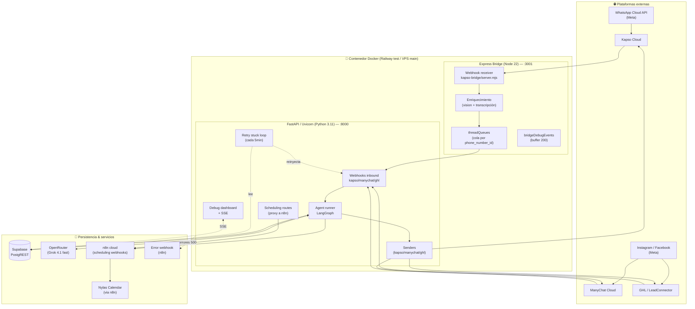
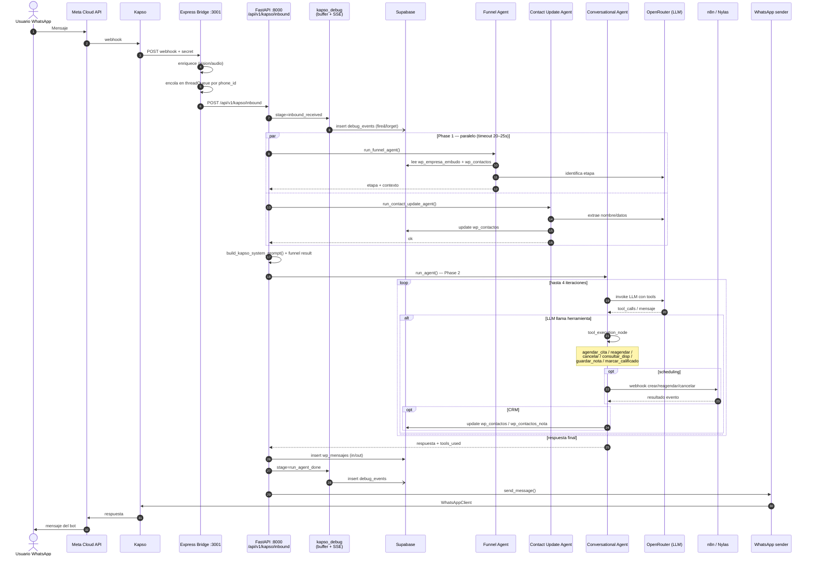
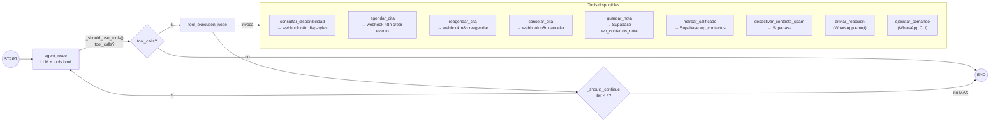
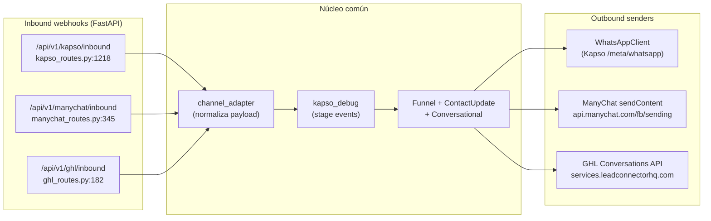
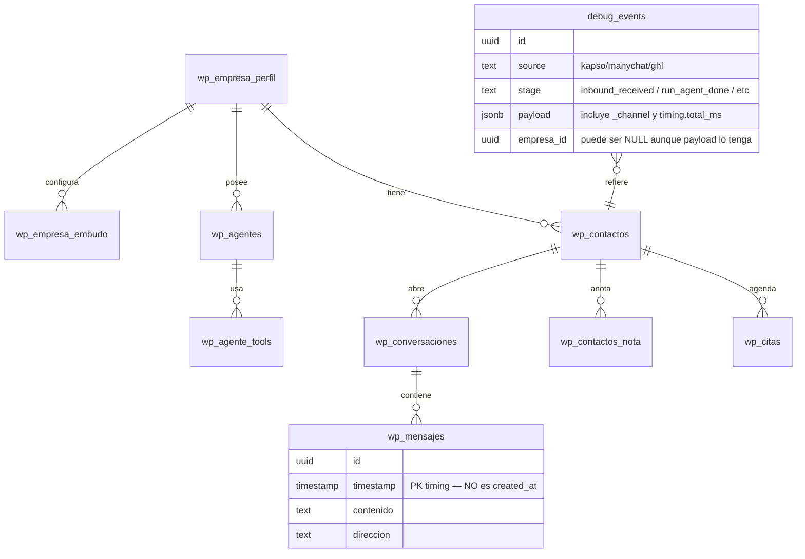
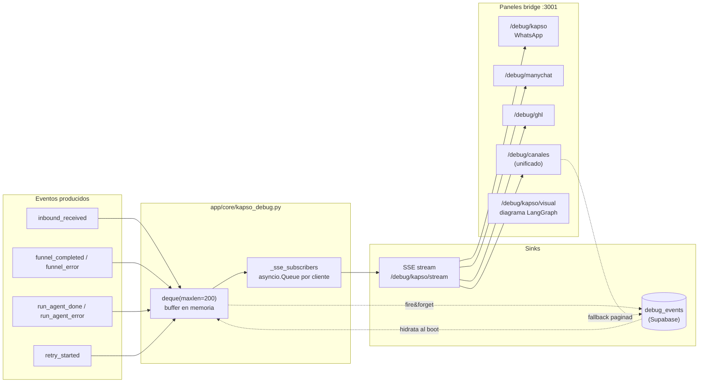
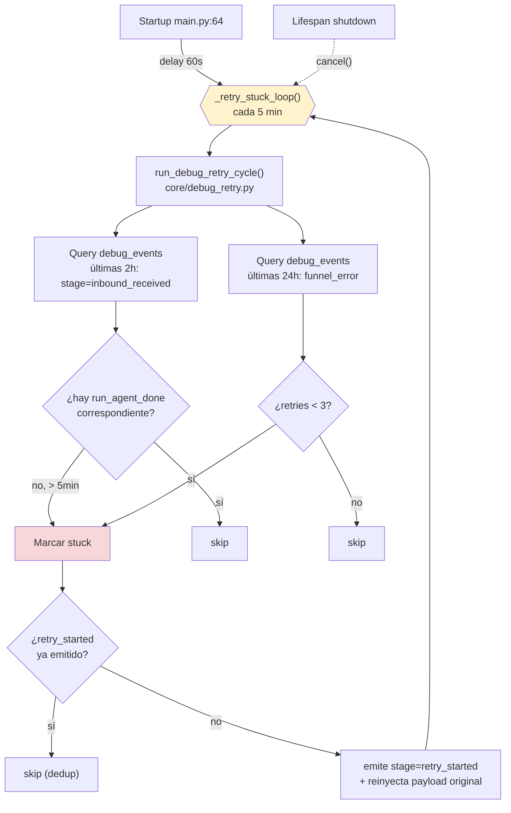
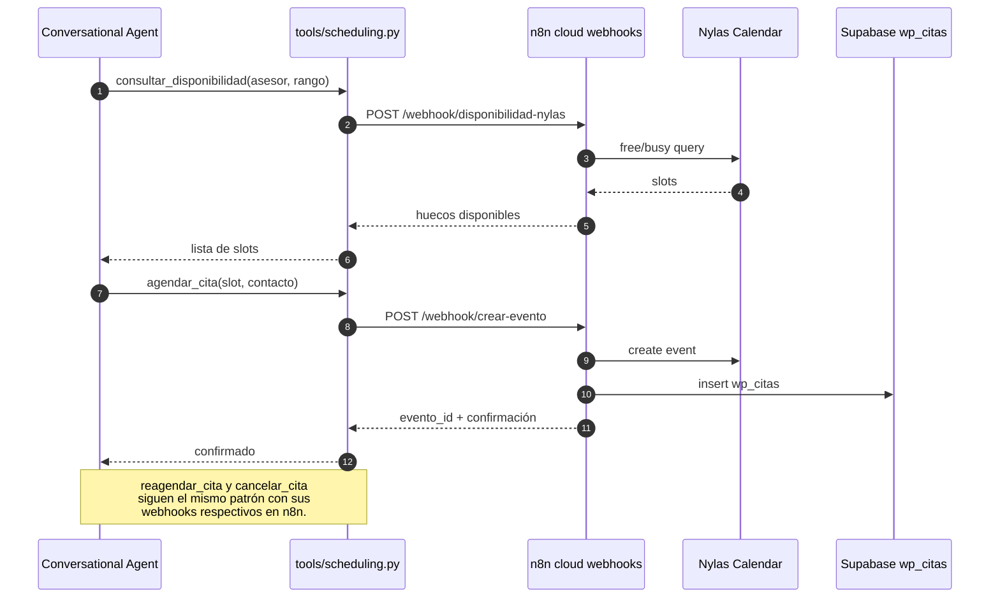
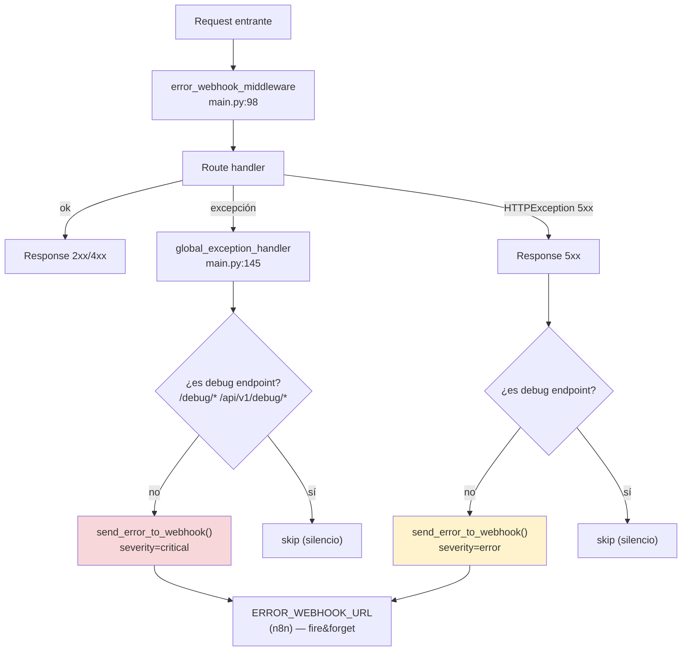

# URPE AI Lab — Arquitectura del Sistema

> Diagramas generados el 2026-04-27 a partir del análisis del código.
> Stack: FastAPI + LangGraph + Supabase + Express bridge + n8n + OpenRouter.

---

## 1. Vista general — Arquitectura de alto nivel



---

## 2. Flujo end-to-end de un mensaje (WhatsApp como ejemplo)



---

## 3. Grafo del Conversational Agent (LangGraph)



**Estado** (`AgentState`): `messages`, `tools_used`, `reaction_emoji`, métricas de timing.
**Constraints**: hard cap 4 iteraciones, timeout 30s por LLM call.
**LLM**: `ChatOpenAI` apuntando a OpenRouter (`x-ai/grok-4.1-fast` por defecto), instancias cacheadas en `_llm_cache`.

---

## 4. Multi-canal — adaptadores y senders



| Canal | Webhook entrada | Sender |
|-------|-----------------|--------|
| WhatsApp | Kapso → Bridge → `/kapso/inbound` | `WhatsAppClient` (Kapso API) |
| Instagram/FB (ManyChat) | `/manychat/inbound` | `POST api.manychat.com/fb/sending/sendContent` |
| Instagram/FB (GHL) | `/ghl/inbound` | `POST /v1/conversations/{id}/messages` |

---

## 5. Persistencia — tablas Supabase



> **Gotchas confirmados (CLAUDE.md)**:
> - `wp_mensajes.timestamp` ≠ resto de tablas que usan `created_at`.
> - `debug_events.empresa_id` puede ser NULL aunque `payload.empresa_id` traiga valor.
> - Timing real vive en `payload.timing.total_ms`, no en `payload.total_ms`.

Cliente: `app/db/client.py` — `httpx.AsyncClient` HTTP/2 pooled (20 max, 10 keepalive), 3 reintentos × 0.8s en 502/503/504/HTML.

---

## 6. Observabilidad — debug & SSE



**Hidratación al startup** (`main.py:62`): `hydrate_from_supabase()` carga últimos 200 eventos de `debug_events` para que el dashboard no quede vacío post-restart.

---

## 7. Background loop — retry de mensajes "stuck"



**Toggle**: `RETRY_STUCK_ENABLED=false` desactiva el loop (útil para debug).
**Max retries**: 3 por `message_id`.

---

## 8. Scheduling — integración con n8n + Nylas



**Webhooks n8n (commits recientes en `f90e186`, `6b0f2df`, `1388d8d`)**:
- `https://marketia.app.n8n.cloud/webhook/disponibilidad-nylas`
- `https://marketia.app.n8n.cloud/webhook/crear-evento`
- `https://marketia.app.n8n.cloud/webhook/reagendar-dashboard`
- `https://marketia.app.n8n.cloud/webhook/cancelar-evento`

**Timeout**: 60s (Nylas + validaciones pueden tardar).
**Política anti-alucinación** (commit `f90e186`): `cancelar_cita` usa estrictamente la respuesta del webhook como fuente de verdad — no inventa confirmaciones.

---

## 9. Manejo de errores — error webhook



---

## 10. Despliegue — dual proceso en un contenedor

```mermaid
flowchart LR
    subgraph IMG["Docker image (node:22-bookworm-slim)"]
        PY["Python 3.11 venv<br/>/opt/venv"]
        APP["/app<br/>(FastAPI source)"]
        BR["/kapso-bridge<br/>(Express source)"]
        DOCS["/docs<br/>(static, montado en /public)"]
    end

    IMG --> ENTRY["docker-entrypoint.sh<br/>+ railway-start.sh"]
    ENTRY --> N["Node Express :3001"]
    ENTRY --> U["Uvicorn FastAPI :8000"]

    N -.INTERNAL_AGENT_API_URL<br/>http://127.0.0.1:8000/api/v1/kapso/inbound.-> U

    subgraph TARGETS["Targets"]
        RAIL["Railway<br/>(branch test)<br/>auto deploy"]
        VPS["VPS Docker<br/>(branch main)<br/>GitHub Actions CI/CD"]
    end

    IMG --> RAIL
    IMG --> VPS
```

**Reglas operativas (CLAUDE.md)**:
- Trabajar siempre en `test` → merge a `main` para producción.
- No mergear con `ort` sin verificar `debug_dashboard.py` y `server.mjs` (merges previos borraron imports).
- `docs/` se copia al image → cambios en docs requieren rebuild.
- Si el bridge crashea, todos los endpoints de WhatsApp caen.

---

## 11. Mapa rápido de archivos clave

| Componente | Archivo |
|------------|---------|
| Entry FastAPI | [main.py](main.py) |
| Bridge Express | [kapso-bridge/server.mjs](kapso-bridge/server.mjs) |
| Webhook WhatsApp | [app/api/kapso_routes.py](app/api/kapso_routes.py) |
| Webhook ManyChat | [app/api/manychat_routes.py](app/api/manychat_routes.py) |
| Webhook GHL | [app/api/ghl_routes.py](app/api/ghl_routes.py) |
| Scheduling routes | [app/api/scheduling_routes.py](app/api/scheduling_routes.py) |
| Conversational agent | [app/agents/conversational.py](app/agents/conversational.py) |
| Funnel agent | [app/agents/funnel.py](app/agents/funnel.py) |
| Contact update agent | [app/agents/contact_update.py](app/agents/contact_update.py) |
| Tool scheduling | [app/tools/scheduling.py](app/tools/scheduling.py) |
| Tool CRM | [app/tools/crm.py](app/tools/crm.py) |
| Cliente Supabase | [app/db/client.py](app/db/client.py) |
| Debug + SSE | [app/core/kapso_debug.py](app/core/kapso_debug.py) |
| Retry loop | [app/core/debug_retry.py](app/core/debug_retry.py) |
| Error webhook | [app/core/error_webhook.py](app/core/error_webhook.py) |
| Dashboard | [app/api/debug_dashboard.py](app/api/debug_dashboard.py) |
| Channel adapter | [app/services/channel_adapter.py](app/services/channel_adapter.py) |
