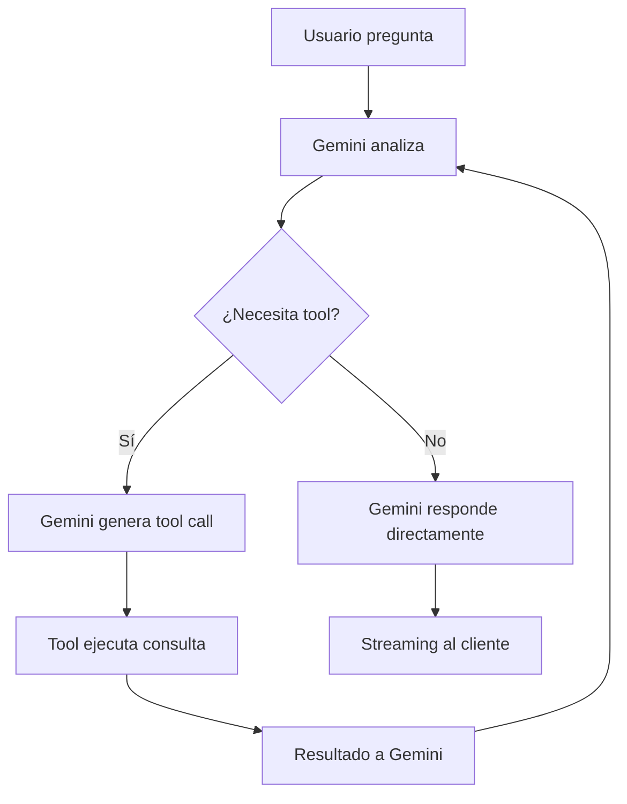

# Contexto del Chat Principal - Asistente IA General de Urpe AI Lab

## 🎯 Propósito y Visión General

**Chat Principal** es la interfaz de inteligencia artificial general de Urpe AI Lab, diseñada para asistir a los usuarios en la generación de contenido, análisis de datos, configuración de agentes y tareas de razonamiento complejo. Es el asistente conversacional central que integra herramientas avanzadas para interactuar con los datos del sistema CRM.

### Ubicación en la Aplicación
- **Componente Principal**: `ChatArea.tsx` y `useChatReliable.ts`
- **Acceso**: Barra lateral principal → Chat
- **Integración**: Contexto empresarial dinámico y herramientas de function calling

---

## 🏗️ Arquitectura del Sistema

### Flujo de Datos Actual (Post-Migración Gemini)
```
Frontend (useChatReliable) → API Route /api/chat → Gemini 3 Flash + Function Calling → Respuesta Streaming
```

### Arquitectura Anterior (Legacy - n8n)
```
Frontend → Edge Function (chat-handler-v2) → n8n Workflow → Gemini 2.5 → Streaming al cliente
```

### Componentes Clave

#### 1. **useChatReliable.ts** - Hook Principal
- **Gestión de Estado**: Mensajes, sesiones, instrucciones personalizadas
- **Streaming**: Manejo de respuestas en tiempo real
- **Persistencia**: LocalStorage + Supabase para sesiones
- **Tools Integration**: Invocación automática de herramientas basadas en queries del usuario

#### 2. **API Route - `/app/api/chat/route.ts`**
- **Autenticación**: Supabase Auth + RLS
- **Gemini Integration**: Cliente directo con Function Calling
- **Streaming**: Server-Sent Events para UX fluida
- **Error Handling**: Logging estructurado y recuperación de errores

#### 3. **Sistema de Tools - `lib/ai/`**
- **`tools.ts`**: Definiciones de herramientas disponibles
- **`tool-executor.ts`**: Implementaciones de consultas a base de datos
- **`gemini-client.ts`**: Cliente Gemini con configuración optimizada

---

## 🔄 Migración a Gemini Direct (COMPLETADA ✅)

### Arquitectura Anterior vs Nueva

| Aspecto | n8n Workflow (Legacy) | Gemini Direct (Actual) |
|---------|----------------------|----------------------|
| **Latencia** | 500ms-2s (múltiples hops) | <200ms (directo) |
| **Costo** | Alto (workflow complejo) | Bajo (solo Gemini) |
| **Debugging** | Difícil (n8n logs) | Fácil (un solo endpoint) |
| **Tools** | Manual en n8n | Function Calling nativo |
| **Multimedia** | Soporte limitado | Gemini 3 multimodal |
| **Escalabilidad** | Limitada por n8n | Ilimitada |

### Beneficios de la Migración
- **Menor Latencia**: Eliminación de intermediarios
- **Mejor Debugging**: Flujo en un solo lugar
- **Function Calling Nativo**: Gemini maneja tools automáticamente
- **Costo Optimizado**: Sin costos de n8n
- **Multimedia Avanzado**: Soporte nativo para imágenes/PDFs

---

## 🛠️ Sistema de Tools - Function Calling

### Tools Disponibles

| Tool | Descripción | Query Base | Parámetros |
|------|-------------|------------|------------|
| **`get_contacts`** | Buscar/filtrar contactos del CRM | `wp_contactos` | `query`, `limit`, `is_active` |
| **`get_appointments`** | Obtener citas programadas | `wp_citas` | `date_range`, `contact_id`, `limit` |
| **`get_conversations`** | Historial de conversaciones | `wp_conversaciones` + `wp_mensajes` | `contact_id`, `limit`, `date_range` |
| **`get_metrics`** | KPIs del dashboard | Múltiples tablas | `date_range`, `enterprise_id` |
| **`create_note`** | Crear nota en contacto | `wp_contactos_nota` | `contact_id`, `content` |
| **`search_messages`** | Buscar en mensajes | `wp_mensajes` | `query`, `contact_id`, `limit` |
| **`get_team_members`** | Miembros del equipo | `wp_team_humano` | `active_only`, `limit` |
| **`get_funnel_stages`** | Etapas del embudo | `wp_empresa_embudo` | `enterprise_id` |

### Implementación Técnica

#### Definición de Tools (`lib/ai/tools.ts`)
```typescript
export const tools = [
  {
    name: 'get_contacts',
    description: 'Buscar y filtrar contactos del CRM',
    parameters: {
      type: 'object',
      properties: {
        query: { type: 'string', description: 'Término de búsqueda' },
        limit: { type: 'number', default: 10 },
        is_active: { type: 'boolean', default: true }
      }
    }
  },
  // ... otros tools
];
```

#### Ejecución de Tools (`lib/ai/tool-executor.ts`)
```typescript
export async function executeTool(toolName: string, args: any) {
  switch (toolName) {
    case 'get_contacts':
      return await getContacts(args);
    case 'get_appointments':
      return await getAppointments(args);
    // ... otros casos
  }
}

async function getContacts({ query, limit = 10, is_active = true }) {
  const { data } = await supabase
    .from('wp_contactos')
    .select('*')
    .ilike('nombre', `%${query}%`)
    .eq('is_active', is_active)
    .limit(limit);
  return data;
}
```

### Invocación Automática
Gemini analiza el mensaje del usuario y decide qué tools invocar:
```
Usuario: "¿Cuántos contactos nuevos tuvimos esta semana?"
Gemini: Necesito get_contacts con filtro de fecha
Tool Result: Lista de contactos
Gemini: Basado en los datos, responde con el conteo
```

---

## 🎨 Experiencia de Usuario

### Interfaz Moderna
- **Tema Oscuro**: Gradientes dinámicos y efectos glow
- **Streaming en Tiempo Real**: Respuestas aparecen carácter por carácter
- **Avatares**: Diferenciación visual user/assistant
- **Markdown**: Soporte completo para respuestas estructuradas
- **Historial**: Últimas 50 sesiones persistidas

### Funcionalidades Avanzadas
- **Instrucciones Personalizadas**: Prompts globales por sesión
- **Sesiones Múltiples**: Manejo de conversaciones paralelas
- **Filtros y Contexto**: Información empresarial integrada
- **Multimedia**: Análisis de imágenes y PDFs adjuntos

### Estados de Interacción
- **Pensando**: Indicador animado mientras Gemini razona
- **Tool Calling**: Notificación cuando se ejecutan consultas
- **Streaming**: Texto aparece gradualmente
- **Completado**: Respuesta final con acciones sugeridas

---

## 🔧 Integración Técnica con Gemini 3

### Configuración Optimizada
```typescript
const geminiConfig = {
  model: 'gemini-3-flash-preview',
  generationConfig: {
    temperature: 0.7,
    maxOutputTokens: 2048,
    thinkingLevel: 'medium'  // Balance costo/calidad
  },
  tools: toolsDefinitions,
  safetySettings: [
    { category: 'HARM_CATEGORY_DANGEROUS_CONTENT', threshold: 'BLOCK_MEDIUM_AND_ABOVE' }
  ]
};
```

### Function Calling Flow


### Manejo de Errores
- **Tool Failures**: Gemini intenta alternativas o explica limitaciones
- **Rate Limits**: Backoff automático con retry
- **Invalid Queries**: Mensajes claros de error con sugerencias
- **Network Issues**: Reintentos con exponential backoff

---

## 📊 Casos de Uso y Ejemplos

### 1. **Análisis de Métricas**
```
Usuario: "¿Cómo están yendo las ventas este mes?"
Tools: get_metrics, get_appointments
Respuesta: Análisis comparativo con tendencias y recomendaciones
```

### 2. **Búsqueda de Contactos**
```
Usuario: "Encuéntrame contactos de Lima interesados en consultoría"
Tools: get_contacts, get_conversations
Respuesta: Lista filtrada con contexto de interacciones previas
```

### 3. **Seguimiento de Citas**
```
Usuario: "¿Qué citas tengo programadas para mañana?"
Tools: get_appointments
Respuesta: Lista cronológica con detalles y recordatorios
```

### 4. **Creación de Notas**
```
Usuario: "Toma nota que Juan Pérez está interesado en el paquete premium"
Tools: get_contacts, create_note
Respuesta: Confirmación de nota creada con enlace al contacto
```

### 5. **Análisis de Conversaciones**
```
Usuario: "¿Cuál es el sentimiento general en las conversaciones recientes?"
Tools: get_conversations, search_messages
Respuesta: Análisis de sentimientos con ejemplos y tendencias
```

---

## 🔒 Seguridad y Multi-Tenancy

### Autenticación y Autorización
- **Supabase Auth**: JWT tokens para identificación de usuario
- **RLS (Row Level Security)**: Filtros automáticos por empresa_id
- **Enterprise Context**: Información empresarial integrada en prompts

### Validación de Datos
- **Zod Schemas**: Validación estricta de inputs y outputs
- **SQL Injection Protection**: Prepared statements en todas las queries
- **Rate Limiting**: Límites por usuario y endpoint

### Auditoría y Logging
- **Activity Logs**: Registro de todas las interacciones
- **Tool Usage**: Tracking de herramientas ejecutadas
- **Error Monitoring**: Alertas para fallos críticos

---

## 🚀 Roadmap y Mejoras Futuras

### Short Term (Próximas 2 semanas)
- [ ] **Tools Avanzados**: Implementar search_messages y team_members
- [ ] **Multimedia**: Soporte completo para análisis de imágenes
- [ ] **Context Caching**: Optimización de costos con caching de contexto

### Medium Term (Próximo mes)
- [ ] **Multi-turn Conversations**: Mejor manejo de contexto en conversaciones largas
- [ ] **Custom Tools**: Permitir creación de tools personalizadas por empresa
- [ ] **Analytics Dashboard**: Métricas de uso del chat

### Long Term (Próximos 3 meses)
- [ ] **Voice Input**: Soporte para comandos por voz
- [ ] **Integration con APIs Externas**: Conexión con calendarios, email, etc.
- [ ] **Advanced Reasoning**: Uso de Gemini Pro para tareas complejas

---

## 🛠️ Guía de Desarrollo

### Para Agregar Nuevos Tools
1. **Definir en `lib/ai/tools.ts`**: Esquema con nombre, descripción y parámetros
2. **Implementar en `tool-executor.ts`**: Función que ejecuta la lógica
3. **Agregar case en executeTool()**: Routing de la ejecución
4. **Testing**: Verificar con queries reales y casos edge

### Para Modificar Configuración Gemini
```typescript
// En gemini-client.ts
const config = {
  model: 'gemini-3-flash-preview',
  thinkingLevel: 'medium',  // low/medium/high
  temperature: 0.7,
  // ... otros parámetros
};
```

### Para Extender Streaming
Agregar lógica en el stream handler:
```typescript
if (parsed.toolResult) {
  // Procesar resultado de tool
  controller.enqueue(encoder.encode(`data: ${JSON.stringify({ toolData })}\n\n`));
}
```

---

## 📈 Métricas y Monitoreo

### KPIs de Rendimiento
- **Response Time**: < 500ms para respuestas simples
- **Tool Accuracy**: 95% de tools ejecutados correctamente
- **User Satisfaction**: Feedback implícito por uso continuado
- **Cost Efficiency**: <$0.01 por conversación promedio

### Monitoring Points
- **Gemini API Usage**: Tokens consumidos por mes
- **Tool Execution Rate**: Porcentaje de queries exitosas
- **Error Rate**: < 2% de conversaciones con errores
- **User Engagement**: Sesiones activas por día

---

## 📚 Referencias Técnicas

### Archivos Clave
- `hooks/useChatReliable.ts` - Gestión principal del chat
- `lib/ai/tools.ts` - Definiciones de herramientas
- `lib/ai/tool-executor.ts` - Implementaciones de tools
- `lib/ai/gemini-client.ts` - Cliente Gemini
- `app/api/chat/route.ts` - Endpoint principal

### Dependencias
- `@google/generative-ai` - SDK oficial de Gemini
- `zod` - Validación de esquemas
- `@supabase/supabase-js` - Cliente de base de datos

### Environment Variables
```env
GEMINI_API_KEY=your_gemini_api_key_here
SUPABASE_URL=your_supabase_url
SUPABASE_ANON_KEY=your_supabase_anon_key
```

---

**El Chat Principal representa la evolución del asistente conversacional en Urpe AI Lab, combinando capacidades avanzadas de IA con integración profunda del sistema CRM para una experiencia de usuario excepcional.**
