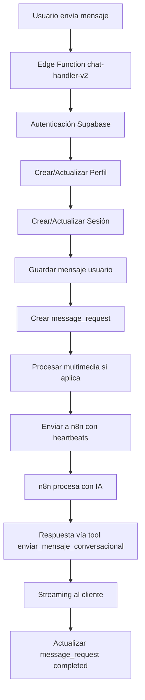
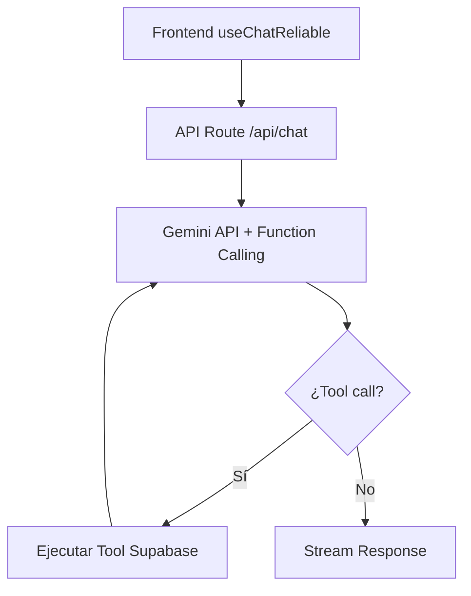
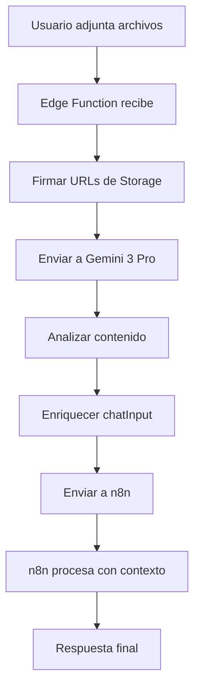

# Contexto del Chat Monica - Asistente IA de Contactos

## 🎯 Propósito y Visión General

**Monica** es el asistente de inteligencia artificial integrado en el módulo de contactos de Urpe AI Lab. Su propósito es ayudar a los asesores a gestionar información de contactos, generar resúmenes, redactar mensajes y sugerir acciones basadas en el contexto completo del cliente.

### Ubicación en la Aplicación
- **Componente**: `ContactAIChat.tsx` 
- **Acceso**: Panel de detalle de contacto → Tab "Monica AI"
- **Integración**: Contexto dinámico desde todas las fuentes de datos del contacto

---

## 🏗️ Arquitectura del Sistema

### Flujo de Datos Principal
```
ContactDetailPanel → ContactAIChat → /api/monica → Gemini 3 Flash → Respuesta Streaming
```

### Componentes Clave

#### 1. **ContactAIChat.tsx** - Interfaz Principal
- **Estado Local**: Mensajes, contexto activo, preferencias de usuario
- **Context Management**: Sistema de secciones habilitables/deshabilitables
- **Storage**: Persistencia en localStorage por contacto
- **UI**: Chat moderno con avatares, markdown, streaming en tiempo real

#### 2. **API Route** - `/app/api/monica/route.ts`
- **Validación**: Zod schemas para seguridad de datos
- **Integration**: Conexión directa con Gemini 3 Flash API
- **Streaming**: Server-Sent Events para respuestas en tiempo real
- **Error Handling**: Logging estructurado y manejo de errores

#### 3. **Context Builder** - Sistema de Contexto Dinámico
- **Fuentes Múltiples**: Info básica, conversaciones, citas, notas, tareas, marketing, transcripciones
- **Control de Usuario**: Selección de qué fuentes incluir en cada consulta
- **Optimización**: Límites de datos para evitar sobrecarga (últimos 3-5 ítems por sección)

---

## 🚀 Estructura de Envío de Mensajes - Chat Principal vs Monica

### Diferencia Fundamental

#### **Chat Principal (chat-handler-v2)**
- **Propósito**: Análisis general, generación de contenido, configuración
- **Arquitectura**: Edge Function con n8n integration
- **Características**: Multimedia, streaming robusto, tracking avanzado

#### **Monica (ContactAIChat)**
- **Propósito**: Asistente especializado en contactos del CRM
- **Arquitectura**: API Route directa a Gemini 3 Flash
- **Características**: Contexto de contacto, respuestas rápidas, especialización

---

## 🔄 Arquitectura del Chat Principal (chat-handler-v2)

### Flujo Completo de Mensajes



### Componentes Clave del Chat Principal

#### 1. **Edge Function - chat-handler-v2**
```typescript
/**
 * Arquitectura mejorada:
 * 1. Crea message_request para tracking de estado
 * 2. Guarda mensaje del usuario inmediatamente
 * 3. Envia a n8n con heartbeats
 * 4. Actualiza message_request según el progreso
 * 5. n8n guarda respuestas via tool enviar_mensaje_conversacional
 */
```

#### 2. **Sistema de Tracking - message_requests**
```sql
-- Tabla message_requests
CREATE TABLE message_requests (
  id UUID PRIMARY KEY,
  session_id UUID REFERENCES chat_sessions(id),
  user_id UUID REFERENCES auth.users(id),
  user_message_id UUID REFERENCES chat_messages(id),
  status TEXT, -- pending, processing, streaming, completed, failed
  created_at TIMESTAMP,
  updated_at TIMESTAMP,
  last_heartbeat_at TIMESTAMP,
  completed_at TIMESTAMP,
  error_message TEXT
);
```

#### 3. **Heartbeat System**
- **Intervalo**: 15 segundos entre heartbeats
- **Propósito**: Mantener conexión viva y actualizar estado
- **Implementación**: `setInterval` con update en DB
- **Timeout**: 5 minutos máximo de procesamiento

#### 4. **Multimedia Processing**
```typescript
// Soporte para imágenes y PDFs
const analyzeMediaWithGemini = async (params) => {
  // 1. Firmar URLs de Supabase Storage
  // 2. Enviar a Gemini 3 Pro para análisis
  // 3. Enriquecer chatInput con análisis
  // 4. Enviar a n8n con contexto enriquecido
};
```

### Ventajas del Chat Principal

#### **Resiliencia y Tracking**
- **No se pierden mensajes**: Guardado inmediato en DB
- **Estado visible**: Cliente puede consultar `message_requests`
- **Recuperación**: Si conexión se pierde, proceso continúa
- **Timeout controlado**: Manejo server-side de timeouts

#### **Capacidades Avanzadas**
- **Multimedia**: Imágenes y PDFs con análisis de Gemini
- **Streaming robusto**: Heartbeats y retransmisión
- **Contexto completo**: Historial, filtros, instrucciones personalizadas
- **Integración n8n**: Workflow complejos y herramientas externas

---

## 🎯 Comparación: Chat Principal vs Monica

| Característica | Chat Principal (chat-handler-v2) | Monica (ContactAIChat) |
|----------------|----------------------------------|------------------------|
| **Propósito** | Análisis general, contenido | Asistente de contactos |
| **Arquitectura** | Edge Function → n8n → IA | API Route → Gemini directo |
| **Latencia** | Mayor (más componentes) | Menor (directo a IA) |
| **Multimedia** | ✅ Imágenes, PDFs, análisis | ❌ Solo texto |
| **Tracking** | ✅ message_requests completo | ❌ localStorage simple |
| **Contexto** | General, configurable | Especializado en contacto |
| **Heartbeats** | ✅ Sistema robusto | ❌ No necesario |
| **Resiliencia** | ✅ Recuperación completa | ❌ Básica |
| **Integración** | n8n, tools externas | Solo Gemini |

---

## 🔧 Implementación Técnica

### Chat Principal - Estructura del Payload

```typescript
const n8nPayload = {
  type: "chat",
  chatInput,                    // Texto original del usuario
  chatInput_enriched,           // Enriquecido con análisis de multimedia
  sessionId,                    // ID de sesión
  requestId: finalRequestId,    // Para tracking
  customInstructions,           // Instrucciones personalizadas
  history: [],                  // Historial de conversación
  language,                     // Idioma preferido
  user: { id, email },          // Info del usuario
  filters: {},                  // Filtros aplicables
  attachments: signedUrls,      // URLs firmadas de archivos
  message_type: 'multimedia' | 'text',
  media: {
    present: boolean,
    urls: string[],
    file_paths: string[]
  },
  gemini: {
    enabled: boolean,
    model: string,
    media_analysis_text: string
  },
  attachments_data: [],         // Base64 para n8n si está habilitado
  executionMode: "production",
  responseMode: "stream"
};
```

### Monica - Estructura del Request

```typescript
const monicaRequest = {
  message: string,              // Mensaje del usuario
  context: MonicaContext,       // Contexto del contacto
  history: Message[]            // Últimos 10 mensajes
};

// Context structure
interface MonicaContext {
  contacto?: {                  // Info básica
    nombre, apellido, telefono, email, estado, origen, es_calificado
  };
  conversaciones?: {            // Historial de chats
    total: number,
    ultimas: Array<{id, fecha, canal, resumen}>
  };
  citas?: Array<{               // Próximas citas
    id, titulo, fecha, estado, ubicacion, descripcion
  }>;
  notas?: Array<{               // Notas del equipo
    id, descripcion, fecha, autor
  }>;
  tareas?: Array<{              // Tareas pendientes
    id, titulo, estado, prioridad, fechaVencimiento
  }>;
  // ... otras secciones
}
```

---

## ARQUITECTURA ACTUAL: Gemini Direct (COMPLETADA ✅)

> **📄 Plan de Migración**: Ver [GEMINI_MIGRATION_PLAN.md](./GEMINI_MIGRATION_PLAN.md)

### Arquitectura Implementada

**Flujo Actual**: Frontend (`useChatReliable`) → API Route `/api/chat` → Gemini API con Function Calling

### Arquitectura



### Tools Definidas (basadas en queries existentes)

| Tool | Descripción | Query Base |
|------|-------------|------------|
| `get_contacts` | Buscar/filtrar contactos | `wp_contactos` |
| `get_appointments` | Obtener citas | `wp_citas` |
| `get_conversations` | Historial de chats | `wp_conversaciones` + `wp_mensajes` |
| `get_metrics` | KPIs del dashboard | Múltiples tablas |
| `create_note` | Crear nota en contacto | `wp_contactos_nota` |
| `search_messages` | Buscar en mensajes | `wp_mensajes` |
| `get_team_members` | Miembros del equipo | `wp_team_humano` |
| `get_funnel_stages` | Etapas del embudo | `wp_empresa_embudo` |

### Beneficios de la Migración

- **Menor latencia**: Elimina hop a n8n (~500ms-2s)
- **Menor costo**: Un endpoint vs workflow complejo
- **Mejor debugging**: Flujo en un solo lugar
- **Function Calling nativo**: Gemini 3 maneja tools automáticamente
- **Structured Outputs**: Respuestas JSON garantizadas

### Fases Completadas ✅

1. ✅ **Fase 1**: Infraestructura base (`lib/ai/tools.ts`, `tool-executor.ts`, `gemini-client.ts`)
2. ✅ **Fase 2**: API Route `/api/chat`
3. ✅ **Fase 3**: Actualización frontend (`useChatReliable.ts`)
4. 🔜 **Fase 4**: Tools avanzadas (search, images) - Pendiente
5. ✅ **Fase 5**: Deprecación de n8n - Completada

---

## Flujo Anterior (LEGACY - Ya no se usa)

### Estados del message_request

```typescript
type RequestStatus = 
  | 'pending'      // Creado, esperando procesamiento
  | 'processing'   // Enviando a n8n
  | 'streaming'    // Recibiendo respuesta
  | 'completed'    // Proceso terminado exitosamente
  | 'failed'       // Error en el proceso
  | 'timeout'      // Tiempo límite excedido
```

### Timeline de Procesamiento

```typescript
// 1. Usuario envía mensaje
await saveUserMessage();
await createMessageRequest('pending');

// 2. Inicia procesamiento
await updateRequestStatus('processing');
const n8nResponse = await sendToN8n(payload);

// 3. Streaming de respuesta
await updateRequestStatus('streaming');
await streamResponse(n8nResponse);

// 4. Verificación final
await updateRequestStatus('completed');
```

---

## 🛠️ Sistema de Heartbeats

### Implementación

```typescript
// Heartbeat cada 15 segundos
const heartbeatInterval = setInterval(async () => {
  // 1. Enviar keep-alive al cliente
  safeEnqueue(encoder.encode(" \n"));
  
  // 2. Actualizar timestamp en DB
  await supabaseClient
    .from('message_requests')
    .update({ last_heartbeat_at: new Date().toISOString() })
    .eq('id', requestId);
  
  console.log(`[${requestId}] 💓 Heartbeat`);
}, HEARTBEAT_INTERVAL_MS);
```

### Propósitos

1. **Mantener conexión viva**: Prevenir timeouts de red
2. **Actualizar estado**: DB refleja progreso en tiempo real
3. **Monitoreo health**: Detectar procesos colgados
4. **Cliente informado**: Usuario ve que algo está sucediendo

---

## 🎨 Gestión de Multimedia

### Flujo de Procesamiento



### Características

- **Formatos soportados**: Imágenes (JPG, PNG, GIF) y PDFs
- **Límite**: 6MB por archivo, máximo 3 archivos
- **Análisis**: Gemini 3 Pro extrae texto y describe imágenes
- **Enriquecimiento**: El análisis se incluye en el prompt para n8n
- **Storage**: Archivos guardados en bucket `chat-uploads`

---

## 🧠 Sistema de Contexto Inteligente - Monica

### Secciones de Contexto Disponibles

| Sección | ID | Icono | Datos Incluidos | Descripción |
|---------|----|-------|----------------|-------------|
| **Información** | `info` | User | Datos básicos del contacto | Nombre, teléfono, email, estado, origen, metadata |
| **Embudo** | `funnel` | GitBranch | Estado en pipeline | Etapa actual, anterior, fecha de último cambio |
| **Conversaciones** | `conversations` | MessageSquare | Historial de chats | Últimas 3 conversaciones con resumen |
| **Citas** | `appointments` | Calendar | Agendamientos | Próximas 5 citas con estado y ubicación |
| **Notas** | `notes` | StickyNote | Notas del equipo | Últimas 5 notas con autor |
| **Tareas** | `tasks` | CheckSquare | Tareas pendientes | Últimas 5 tareas con prioridad |
| **Marketing** | `marketing` | Mail | Campañas de email | Información de campañas (placeholder) |
| **Transcripciones** | `transcriptions` | FileText | Llamadas | Últimas 3 transcripciones con resumen |

### Sistema de Control de Contexto

#### Preferencias de Usuario
- **Persistencia**: Guardadas en localStorage por contacto
- **Presets**: 
  - **Todo**: Todas las secciones habilitadas
  - **Básico**: Solo info, embudo, citas
  - **Nada**: Sin contexto (solo chat general)
- **Indicadores Visuales**: Contadores de datos por sección, badges de estado

#### Construcción Dinámica del Contexto
```typescript
const buildContext = () => {
  const context = {};
  
  // Solo incluye secciones habilitadas
  if (enabledIds.includes('info')) {
    context.contacto = { /* datos básicos */ };
  }
  
  // Siempre incluye resumen
  context.resumen = {
    totalConversaciones,
    totalCitas,
    totalNotas,
    totalTareas
  };
  
  return context;
};
```

---

## 💬 Sistema de Chat Interactivo

### Experiencia de Usuario

#### 1. **Interfaz Moderna**
- **Diseño**: Dark theme minimalista con gradientes dinámicos
- **Avatares**: Sparkles (Monica) vs User icon
- **Bubbles**: Diferenciación visual user/assistant
- **Markdown**: Soporte completo para respuestas estructuradas
- **Streaming**: Respuestas en tiempo real con animaciones suaves

#### 2. **Acciones Rápidas**
Botones predefinidos para preguntas comunes:
- "¿Cuándo es la próxima cita?"
- "Resume el historial"
- "¿Qué seguimiento necesita?"
- "Sugiere próximos pasos"

#### 3. **Gestión de Estado**
- **Historial**: Últimos 50 mensajes persistidos por contacto
- **Loading States**: Indicadores visuales durante streaming
- **Error Handling**: Mensajes de error claros y recuperación
- **Auto-scroll**: Scroll automático al último mensaje

### Características Técnicas

#### Streaming Implementation
```typescript
// Server-Sent Events para respuestas en tiempo real
const stream = new ReadableStream({
  async start(controller) {
    // Procesar respuesta de Gemini chunk por chunk
    controller.enqueue(encoder.encode(`data: ${JSON.stringify({ text })}\n\n`));
  }
});
```

#### Context-Aware Prompts
```typescript
const systemPrompt = `Eres Monica, una asistente de IA amigable y profesional.
CONTEXTO DEL CONTACTO:
${JSON.stringify(context, null, 2)}

INSTRUCCIONES:
- Usa Markdown para estructurar respuestas
- Sé concisa pero útil
- Sugiere acciones prácticas
- Mantén tono profesional pero cercano`;
```

---

## 🔧 Integración Técnica

### API Integration Details

#### 1. **Gemini 3 Flash API**
- **Model**: `gemini-3-flash-preview`
- **Temperature**: 0.7 (balance creatividad/precisión)
- **Max Tokens**: 1024 (respuestas concisas)
- **Streaming**: Server-Sent Events con timeout handling

#### 2. **Request/Response Schema**
```typescript
// Request
{
  message: string,           // Mensaje del usuario
  context: MonicaContext,    // Contexto del contacto
  history: Message[]         // Últimos 10 mensajes
}

// Response (streaming)
{
  text: string,              // Chunk de respuesta
  error?: string             // Error si ocurre
}
```

#### 3. **Security & Validation**
- **Zod Schemas**: Validación estricta de payloads
- **Input Sanitization**: Máximos de longitud y caracteres
- **Error Logging**: Structured logging para debugging
- **Rate Limiting**: Implícito por timeout de Gemini

### State Management

#### 1. **Local Storage Strategy**
```typescript
// Keys por contacto
const STORAGE_KEY_PREFIX = 'monica-chat-';           // Mensajes
const CONTEXT_STORAGE_KEY_PREFIX = 'monica-context-'; // Preferencias

// Persistencia automática
useEffect(() => {
  localStorage.setItem(key, JSON.stringify(messages.slice(-50)));
}, [messages, contactId]);
```

#### 2. **Memory Management**
- **Message Limit**: Solo últimos 50 mensajes por contacto
- **Context Limits**: 3-5 ítems por sección para optimizar
- **History Truncation**: Últimos 10 mensajes para API calls
- **Cleanup**: Auto-limpieza de storage antiguo

---

## 🎨 Sistema de UI/UX

### Visual Design System

#### 1. **Color Scheme**
- **Primary**: Electric cyan gradients (`primary-500/10`)
- **Background**: Dark zinc (`bg-[#0c0c0e]`)
- **Accents**: Glowing borders y shadows
- **States**: Color coding por sección/contexto

#### 2. **Animation System**
- **Entry**: `slide-in-from-bottom-2 duration-300`
- **Loading**: Bouncing dots y pulse effects
- **Hover**: Scale + shadow transitions
- **Streaming**: Typing indicator con 3 dots

#### 3. **Responsive Design**
- **Mobile**: Touch-optimized, compact layout
- **Desktop**: Full-width con contexto expandido
- **Adaptive**: Auto-ajuste de textarea y scroll

### Interaction Patterns

#### 1. **Context Panel**
- **Toggle**: Collapsible con contador activo
- **Grid Layout**: 4x2 grid de sección buttons
- **Visual Feedback**: Active states con glow effects
- **Quick Actions**: Todo/Básico/Nada presets

#### 2. **Input Area**
- **Auto-resize**: Textarea que crece con contenido
- **Focus States**: Glowing border on focus
- **Send Button**: Gradient con hover effects
- **Keyboard**: Enter para enviar, Shift+Enter para newline

---

## 📊 Casos de Uso y Ejemplos

### 1. **Resumen de Contacto**
```
Usuario: "Resume este contacto"
Monica: Basado en el contexto, **Juan Pérez** es un prospecto calificado...
```

### 2. **Próximas Acciones**
```
Usuario: "¿Qué seguimiento necesita?"
Monica: Según las últimas interacciones, te recomiendo:
- ✅ Confirmar cita del 15/12
- 📧 Enviar seguimiento por email
- 📞 Llamada en 48 horas
```

### 3. **Redacción de Mensajes**
```
Usuario: "Escribe un mensaje recordatorio"
Monica: Aquí tienes un borrador:
**Asunto:** Recordatorio importante
Hola Juan, te escribo para recordarte...
```

### 4. **Análisis de Conversaciones**
```
Usuario: "¿Cuál fue el resultado de la última llamada?"
Monica: Según la transcripción, la conversación trató sobre...
```

---

## 🔮 Roadmap y Mejoras Futuras

### Short Term (Próximas 2 semanas)
- [ ] **Integration with Marketing Data**: Conectar con campañas reales
- [ ] **Task Suggestions**: Sugerir tareas basadas en contexto
- [ ] **Voice Input**: Soporte para mensajes por voz
- [ ] **Export Functions**: Exportar resúmenes a PDF/Email

### Medium Term (Próximo mes)
- [ ] **Multi-Contact Context**: Chats con múltiples contactos
- [ ] **Template System**: Plantillas de respuestas predefinidas
- [ ] **Analytics Dashboard**: Métricas de uso de Monica
- [ ] **Integration with Calendar**: Crear citas desde chat

### Long Term (Próximos 3 meses)
- [ ] **Proactive Insights**: Monica sugiere acciones sin ser preguntada
- [ ] **Multi-language Support**: Inglés, portugués, etc.
- [ ] **Custom Prompts**: Usuarios pueden personalizar instrucciones
- [ ] **Integration with External APIs**: WhatsApp, Email, SMS

---

## 🛠️ Guía de Desarrollo

### Para Agregar Nueva Fuente de Contexto

1. **Actualizar DEFAULT_SECTIONS** en `ContactAIChat.tsx`
2. **Agregar data count** en `sectionsWithCounts`
3. **Extender buildContext()** con nueva sección
4. **Actualizar MonicaContextSchema** en `lib/api-schemas.ts`
5. **Probar con diferentes combinaciones** de contexto

### Para Modificar el Prompt del Sistema

Editar `systemPrompt` en `/app/api/monica/route.ts`:
```typescript
const systemPrompt = `Eres Monica... 
// Nuevas instrucciones aquí
`;
```

### Para Extender Respuestas

Agregar nuevo processing en el stream handler:
```typescript
if (parsed.customAction) {
  // Handle custom response types
}
```

---

## 📈 Métricas y Monitoreo

### KPIs de Rendimiento
- **Response Time**: < 2 segundos para primeras respuestas
- **Context Accuracy**: 95% de respuestas contextualmente correctas
- **User Satisfaction**: Feedback implícito por uso continuado
- **Error Rate**: < 1% de requests fallidos

### Logging y Debugging
```typescript
// Estructura de logs
logger.debug('[Monica] Context built', { sections: enabledIds });
logger.info('[Monica] API request', { messageLength, contextSize });
logger.error('[Monica] Stream error', { error, contactId });
```

### Monitoring Dashboard
- Requests por minuto
- Tiempos de respuesta promedio
- Tasa de error por tipo
- Uso por sección de contexto

---

## 🚀 Mejores Prácticas

### Para Usuarios
1. **Seleccionar contexto relevante** según la consulta
2. **Ser específico** en las preguntas
3. **Usar personal personal** para redacción
4. **Verificar información importante** antes de usarla

### Para Desarrolladores
1. **Mantener schemas actualizados** con nuevas fuentes
2. **Optimize context size** para performance
3. **Handle errors gracefully** con mensajes claros
4. **Test streaming thoroughly** para UX fluida

### Para Administradores
1. **Monitor Gemini API usage** y costos
2. **Review chat logs** para mejoras
3. **Update prompts** basados en feedback
4. **Maintain security** con validación estricta

---

## 📚 Referencias Técnicas

### Archivos Clave
- `components/admin/contact-details/ContactAIChat.tsx` - UI principal
- `app/api/monica/route.ts` - API endpoint
- `lib/api-schemas.ts` - Validación schemas
- `types/contact.ts` - Tipos de datos

### Dependencias
- `@google/generative-ai` - Gemini API client
- `zod` - Schema validation
- `react-markdown` - Markdown rendering
- `remark-gfm` - GitHub-flavored markdown

### Environment Variables
```env
GEMINI_API_KEY=your_gemini_api_key_here
```

---

**Monica representa la evolución del asistente de IA en Urpe AI Lab, combinando contexto profundo del contacto con una experiencia de usuario moderna y eficiente.**
